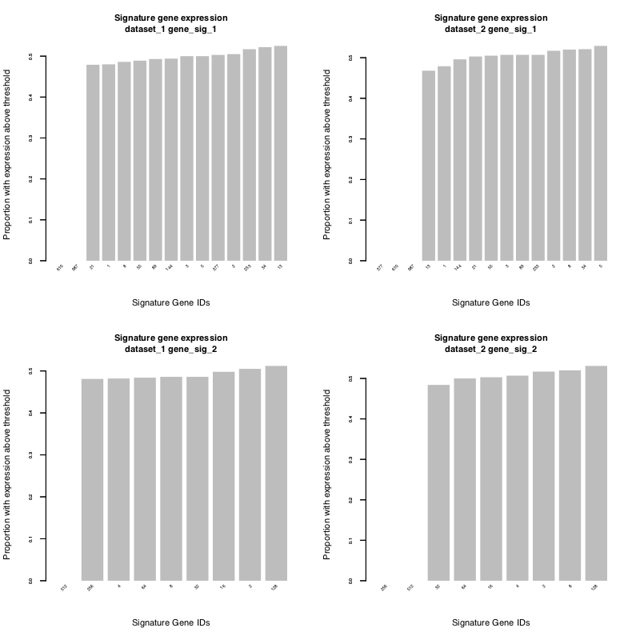
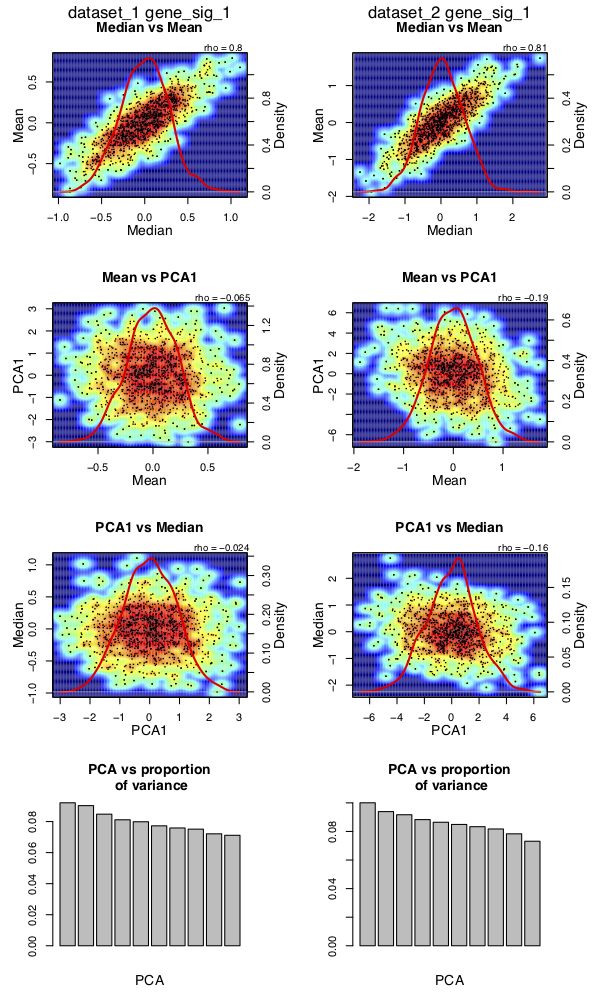
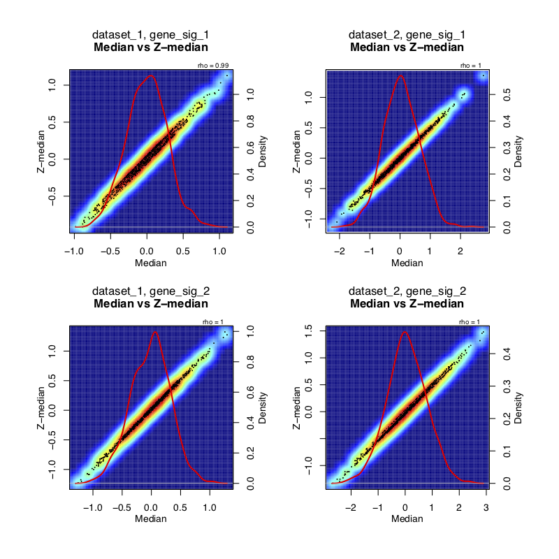

# Introduction and _sigQC_ protocol overview
Inreasing amounts of genomic data mean that gene expression signatures are becoming critically important tools, poised to make a large impact on the diagnosis, management and prognosis for a number of diseases. For the purposes of this package, we define the term __gene signature__ to mean: 'a set of genes whose co-ordinated mRNA expression pattern is representative of a biological pathway, process, or phenotype, or clinical outcome.'

A key issue with gene signatures of this nature is whether the expression of many genes can be summarised as a single score, or whether multiple components are represented. In this package, we have automated the testing of a number of quality control metrics designed to test whether a single score, such as the median or mean, is an appropriate summary for the genes' expression in a new dataset. Furthermore, the tools in this package enable the visualization of properties of a set of genes in a specific dataset, such as expression profile, variability, correlation, and comparison of methods of standardisation and scoring metrics for wider scope application.s


# Package installation
To install the _sigQC_ package, run the following code:
```r
install.packages('sigQC')
```

# Reference

**Please cite _sigQC_ if you use it in any of your workflows:** 

Dhawan, Andrew, Alessandro Barberis, Wei-Chen Cheng, Enric Domingo, Catharine West, Tim Maughan, Jacob G. Scott, Adrian L. Harris, and Francesca M. Buffa. ``Guidelines for using sigQC for systematic evaluation of gene signatures.'' _Nature protocols_ 14, no. 5 (2019): 1377-1400.


# General overview

The _sigQC_ package is designed to be a single function __make_all_plots()__, capable of customising outputs as needed for the user, based on the inputs provided.

The basic inputs are as follows:

* ```gene_sigs_list```: A __list__ of gene signatures, such that ```gene_sigs_list[[sig_name]]``` is a k row x 1 column character matrix for the gene set corresponding to ```sig_name```
* ```mRNA_expr_matrix```: A __list__ of mRNA gene expression matrices, such that ```mRNA_expr_matrix[[dataset_name]]``` is a matrix with rows corresponding to genes, and columns to samples, of normalised, batch-corrected, and log-transformed (if needed), mRNA expression values
* ```names_sigs```: (Optional) A __vector__ of the names of the elements of ```gene_sigs_list```
* ```names_datasets```: (Optional) A __vector__ of the names of the elements of ```mRNA_expr_matrix```
* ```covariates```: (Optional) A __list__ containing a sub-list of `annotations’ and `colors’ which contains the annotation
matrix for the samples in a given dataset and the associated colours, for plotting in the expression heatmap
* ```thresholds```: (Optional) A __list__ of thresholds to be considered for each data set, default is median expression of _all genes_ of a data set. A gene is considered expressed if above the threshold, non-expressed otherwise. One threshold per dataset, in the same order as the dataset list.
* ```out_dir```: (Optional) A __string__ specifying the location/name of the directory where outputs should be saved to
* ```showResults```: (Optional) A __boolean__ specifying whether to display the output plots in R graphics windows or not
* ```origin```: (Optional) A character __vector__ with each character describing the origin of the different datasets (used only in the computation of rank product statistic among intra-signature correlation matrices, to account for batch effects)
* ```doNegativeControl```: (Optional) A __boolean__ specifying whether to do the negative and permutation control  resampling for each signature/dataset combination; note that if true, it will take significantly longer to run _sigQC_
* ```numResampling```: (Optional) A __numeric__ value specifying the number of resampling runs to perform for the negative and permutation controls

# Sample workflow

The premise behind _sigQC_ is to input primarily two things - the gene signatures and the datasets to test them upon. Once these inputs are prepared in the correct format, the ```make_all_plots``` function can be run, with settings as per user needs, generating the quality control plots needed to ascertain how each signature performs on each dataset considered. 

Below, we consider the case of two random datasets and random gene signatures, and show how to customise each of the inputs.

## Step 1: Preparation of input data

Input data should consist of lists of expression matrices, and should be pre-normalised, batch-corrected, and standardised if required. Care should be taken to ensure that genes of interest are present in the dataset and not reported primarily as NA values. Gene signatures must be annotated in a manner consistent with the input data. 

```{r}
dataset_1 <- replicate(1000, rnorm(500,mean=0,sd=1))#random matrix - 1000 genes x 500 samples
row.names(dataset_1) <- as.character(1:(dim(dataset_1)[1])) #set the gene names
colnames(dataset_1) <- paste0('d1_',as.character(1:(dim(dataset_1)[2]))) #set the sample IDs

dataset_2 <- replicate(1000, rnorm(250,mean=0,sd=2))#random matrix - 1000 genes x 250 samples
row.names(dataset_2) <- as.character(1:(dim(dataset_2)[1])) #set the gene names
colnames(dataset_2) <- paste0('d2_',as.character(1:(dim(dataset_2)[2]))) #set the sample IDs

#gene sets that we are going to use for our gene signatures
gene_sig_1 <- c('1','2','3','5','8','13','21','34','55','89','144','233','377','610','987') 
gene_sig_2 <- c('2','4','8','16','32','64','128','256','512')
```

Any specific expression thresholds for expression (other than global median) should be computed, as this is the default the package uses as an expression cutoff.

## Step 2: Creation of input variables

Next, we load the input datasets and gene signatures into list format.

```{r}
mRNA_expr_matrix = list()
mRNA_expr_matrix[["dataset_1"]] = dataset_1
mRNA_expr_matrix[["dataset_2"]] = dataset_2

gene_sigs_list = list()
gene_sigs_list[['gene_sig_1']] = as.matrix(gene_sig_1)
gene_sigs_list[['gene_sig_2']] = as.matrix(gene_sig_2)
```

We then set the other non-default valued input variables as needed for our analysis:

```{r}
showResults <- FALSE # we do not want to show the reuslts in R graphics windows
doNegativeControl <- FALSE # we do not want to compute the negative or permutation controls for time purposes
```

## Step 3: Running of _sigQC_ package

```r
library("sigQC")

make_all_plots(gene_sigs_list, mRNA_expr_matrix, showResults = showResults, doNegativeControl = doNegativeControl)
```
This will produce, in the desired output directory, a number of plots in PDF files which may be analysed as described in the subsequent steps. The package also creates an output file `log.log' in the output directory, a text file, which summarises the run, and reports any errors that may have occurred if they are not printed to the console. This should be consulted if any issues are encountered in the running of this principal function and for troubleshooting purposes.

## Step 4: Analysis of expression

Expression of signature genes should be evaluated across samples in all datasets, and this is done by analysis of the plots sig_expr_*.pdf.

These plots describe the proportion of samples with supra-threshold expression of each signature gene (either for the median threshold, or user-specified as above), and the proportion of samples with non-NA values, identifying non-expressed signature components.

{ width=80% }

## Step 5: Analysis of variability

To check signature gene variability, load the file 'sig_mean_vs_sd.pdf.' These plots describe the mean and standard deviation of expression of all genes reported (in grey) versus all signature genes (in red), with corresponding dashed lines over the plots describing the 10th, 25th, 50th, 75th and 90th percentiles of both mean and standard deviation. 

This facilitates the easy identification of those signature genes, which are not variable or expressed sufficiently among the samples, as well as a global evaluation of signature behaviour across samples of a dataset.

{ width=80% }


## Step 6: Analysis of co-correlation of scoring metrics

Next, loading the files called ‘sig_compare_metrics_*.pdf’ it is possible to analyse the co-correlation of mean, median and first principal component (PCA1) as scoring metrics across the samples for each signature across each dataset.

Also shown in the fourth row of panels of these plots is a principal components analysis (PCA) scree plot, which describes the proportion of the variance attributable to each principal component, which may reflect whether the first PCA represents a reasonable scoring summary metric for a particular gene signature.

{ width=80% }

In addition, loading the files called 'sig_compare_ES_metrics_*.pdf', we provide analogous co-correlation plots for each of GSVA, ssGSEA, and PLAGE scores, also showing the distribution of these scoring metrics. These scores are based on the techniques implemented by the GSVA R package, which is a dependency of _sigQC_, and the original package and publications by Hanzelman et al., 2013, Barbie et al., 2009, and Tomfohr et al., 2005 should be consulted for details of the calculation of these metrics. As these are enrichment socre-based metrics, these are best used in concert with the quality control for signatures based on enrichment analysis results, such as those from MSigDB.

Also, loading the files called 'scoring_metrics_corr_*.pdf', one can observe the co-correlation between all of the six scoring metrics considered (mean, median, PCA1, GSVA, ssGSEA, and PLAGE) as a heatmap of Spearman correlation coefficients. Again, this is of particular use for signatures derived based on enrichment analyses.

### Analysis of normality of scoring metrics

In the files called 'sig_qq_plots_*.pdf.' we show QQ plots against the normal distribution, to depict how close to normally the signature scores are distributed across the datasets, for the mean, median, and first principal component.

{ width=80% }

### Analysis of modality of scoring metrics

Next, to understand the modality of the distributions of the scoring metrics across the datasets, we use the _mclust_ package to compute the Bayes Information Criterion (BIC) for the likelihood of different Gaussian mixture models. The files called 'sig_gaussian_mixture_model_*.pdf' provide plots of the modality on the x axis for each type of considered Gaussian mixture model, and the corresponding BIC on the y-axis.

Note that we have also provided a text output interpreting the modality for each scoring metric in each dataset/signature combination in the file 'mixture_model_out.txt.'

Lastly, we save each of the raw ouptuts from the mclust call in the file 'mixture_models_raw_out.rda' in a list variable called `mixture_models`, with the following structure.

`mixture_models[[signature_name]][[dataset_name]][[metric_type]]` will contain the mclust output for the Gaussian mixture model fitting for the metric_type (one of 'median','mean',or 'pca1', referring to the scoring criteria) for the dataset called 'dataset_name' and the signature called 'signature_name.'

{ width=80% }


## Step 7: Analysis of data standardisation effects

To study data standardisation effects, load the output file called ‘sig_standardisation_comp.pdf.’. This plot provides the comparison of median of gene signature expression on the raw data provided versus the median of the gene signature expression on the z-transformed (standardised to zero mean and unit variance) dataset, for each sample in each dataset and each gene signature under consideration.


{ width=80% }

## Step 8: Analysis of signature compactness

The files produced in the output directory called ‘sig_autocor_hmaps.pdf’ and ‘sig_autocor_dens.pdf’ provide heatmap and kernel density estimate plots of the correlation of each signature genes’ expression with the expression of every other signature gene, providing an analysis of signature compactness. 

In addition to these plots produced for the analysis of intra-signature correlation, the files ‘sig_autocor_rankProd_*.pdf’ are produced when there is more than one dataset present for a given gene signature (not shown for this analysis). These plots represent the output of the BioConductor RankProduct package in the evaluation of signature genes whose median intra-signature correlation with all other genes consistently ranks low with the other signature genes. This facilitates the process for finding genes with consistent poor intra-signature correlation with the other genes of the gene signature, particularly when refining a given signature for optimal performance across a number of different datasets (e.g. multiple clinical cohorts, or clinical data and cell line data).

{ width=80% }

## Step 9: Analysis of signature structure

Firstly, signature structure can be evaluated by hierarchical clustering on the provided expression values of the signature elements over all samples, in conjunction with annotations for the samples, if they are provided. These plots are present in the output directory and are named ‘sig_eval_struct_clustering_*.pdf,’ which are clustered based on each dataset in turn, and run over each signature and each dataset present. 


{ width=80% }


In addition to hierarchical clustering on patient samples and signature genes, in the output directory of {\em sigQC}, biclustering results can be found if there is a case of biclustering found among the sample groups and signature genes are found (not shown for this analysis). The particular details of the biclustering outputs and algorithm used may be found in the R Package documentation. If no biclusters are found, the files ‘sig_eval_bivariate_clustering.pdf’ are not produced.

## Step 10: Optional: Comparison of multiple signatures

The file produced, named ‘sig_radarplot.pdf’ describes each signature applied to each dataset in a holistic, radar chart format. This plot evaluates the gene signature across a number of QC metrics, many of which are summary metrics for those in steps 4-9 of this procedure, and these are described in detail in the Table below. 


{ width=80% }


## Step 11: Optional: Analysis of null distributions of _sigQC_ metrics (resulting in longer runtimes)

The file produced called 'boxplot_metrics.pdf,' (not produced in this example) in the negative_control subfolder of the results output shows the distributions of each of the fourteen summary metrics as reported in the radar plot for each signature and dataset combination. These distributions are generated for the number of repeats as specified by the input parameter numResampling, with default set to 50. The values for the gene signature and dataset combination in question are shown in red overlaid with the other points in grey, giving a sense of significance of each of the metrics. 

In addition, the file produced called 'boxplot_metrics.pdf' (not produced in this example) in the permutation_control subfolder of the results output shows the distributions of each of the fourteen summary metrics for each signature and dataset combination as well. These distributions are produced by permuting the gene labels for each sample, for each of the signature genes present in each dataset. The number of times this process is done is given by the input parameter numResampling, with default set to 50. As with the random gene signatures, the values for the gene signature and dataset combination in question are shown in red overlaid with the other points in grey. These metrics help provide an interpretation of the gene signature's significance with respect to resampling among the same genes, to generate another set of null distributions that can be used in the evaluation of a gene signature.

# Metrics

The radarplot produced has 14 axes, each representative of one of the following metrics, which we outline here (for further details, see reference [1]): 

* __Relative Med. SD__: Relative median standard deviation of signature genes as compared median standard deviation of all genes. Consider the standard deviation of all signature elements' expression across all samples, then consider the median of this list, $\alpha$. Similarly consider the median of the standard deviation of all reported genes across all samples, $\beta$. Value considered is $|\alpha / (\alpha + \beta)|$, where $|.|$ represents the absolute value.

* __$\rho_{Med., Z-Med.}$__: Absolute correlation coefficient of median of signature genes and median of signature genes on z-transformed dataset. Absolute value of Spearman correlation coefficient between median and z-median of signature elements, used as scoring metrics across samples.

* __$\rho_{Mean, PCA1}$__:	Absolute correlation coefficient of mean and first principal component of signature genes. Absolute value of Spearman correlation coefficient between mean and first principal component of signature elements, used as scoring metrics across samples.

* __$\rho_{PCA1, Med.}$__:	Absolute correlation coefficient of first principal component and median of signature genes.	Absolute value of Spearman correlation coefficient between first principal component and z-median of signature elements, used as scoring metrics across samples.

* __$\rho_{Mean, Med.}$__:	Absolute correlation coefficient of mean and median of signature genes.	Absolute value of Spearman correlation coefficient between mean and median of signature elements, used as scoring metrics across samples.

* __Intra-sig. Corr.__: Median of intra-signature correlation values for all signature genes. Median of list of all correlation coefficients for each signature element with every other signature element.

* __Prop. Expressed__:	Median proportion of samples expressing signature genes above threshold. Median value of list of proportions of samples expressing each signature element above threshold for each signature element. Threshold is defined as median of expression of all genes, if not user-specified.

* __Non-NA Prop.__:	Median over all samples expressing each element as non-NA. Median value of list of proportions of samples which have expression not recorded as NA, for each signature element.

* __Coef. of Var.__: Median coefficient of variation of all signature genes, relative to the median coefficient of variation of all genes. Consider the coefficient of variation of all signature elements across all samples, then consider the median of this list, $\alpha$. Similarly consider the median of the coefficient of variation of all reported genes across all samples, $\beta$. Value considered is $|\alpha / ( \alpha + \beta )|$, where $|.|$ represents the absolute value.

* __$\sigma_{\ge 50\%}$__: Proportion of signature genes in the top 50\% of all varying genes. This is the proportion of signature elements that have coefficients of variation in the top 50\% of all coefficients of variation for all genes.

* __$\sigma_{\ge 25\%}$__: Proportion of signature genes in the top 25\% of all varying genes. This is the proportion of signature elements that have coefficients of variation in the top 25\% of all coefficients of variation for all genes.

* __$\sigma_{\ge 10\%}$__: Proportion of signature genes in the top 10\% of all varying genes. This is the proportion of signature elements that have coefficients of variation in the top 10\% of all coefficients of variation for all genes.

* __Skewness__: Relative skew of distribution of signature gene expression over all samples compared with skewness of overall expression distribution for all genes. Consider the skewness of the distribution for the mean expression of all signature elements across all samples, $\alpha$. Similarly consider the skewness of the distribution for the mean expression of all genes across all samples, $\beta$. Value considered is $|\alpha |/(|\alpha | + |\beta|)$, where $|.|$ represents the absolute value.

* __$\sigma_{PCA1}$__:	Proportion of gene signature score taken by median, by first principal component. This is the proportion of the variance of gene signature score that is explained by the first principal component of the expression of the signature genes taken across all samples.


# Troubleshooting

## Imagemagick dependency
Issues may be experienced if the 'ImageMagick' dependency is not installed on the user's system (particularly for Windows systems). 
To install this dependency, please follow directions at: <https://imagemagick.org/script/download.php>.

## RStudio plot size issue
There is a known issue with RStudio plot size being too small causing errors with the plots being produced, even if they are not displayed in RStudio. The error in this case will appear in the log file as: ```Error in graphics::plot.new(): figure margins too large```.

In this case, expand the plot size in the RStudio editor, and also click the maximise button on the plot window of RStudio, and re-run the package.

## Input data specifications
*	Gene signatures must be formatted as a __list__ of matrices, of dimension $k$ rows by 1 column, for a signature of length $k$ genes. Inputting a single list as a vector will cause an error to the program.
*	Datasets must also be formatted as a __list__ of matrices, such that genes are the rownames of the dataset, and samples are organised by columns of the dataset.
*	Gene signatures and datasets must be annotated in the same way, as if the names of the genes of a signature are not found in a dataset, the computation will not continue.
*	Care must be taken to ensure that NA valued genes are removed as optimally as possible, as if there are too many values in the expression matrix for the gene signature are NA, calculations dependent upon singular value decomposition (e.g. principal components analysis) cannot be carried out.


# Dependencies

The _sigQC_ package depends on having installed versions of the following packages, and R $\ge$ 3.3.0

* MASS  
* lattice
* KernSmooth
* cluster
* nnet
* class
* gridGraphics
* biclust
* gplots
* ComplexHeatmap 
* RankProd
* fmsb
* moments
* grDevices
* graphics
* stats
* utils
* mclust
* GSVA
* Imagemagick

# References

1.  Dhawan, Andrew, Alessandro Barberis, Wei-Chen Cheng, Enric Domingo, Catharine West, Tim Maughan, Jacob G. Scott, Adrian L. Harris, and Francesca M. Buffa. ``Guidelines for using sigQC for systematic evaluation of gene signatures.'' _Nature protocols_ 14, no. 5 (2019): 1377-1400.

<!-- ## Styles -->

<!-- The `html_vignette` template includes a basic CSS theme. To override this theme you can specify your own CSS in the document metadata as follows: -->

<!--     output:  -->
<!--       rmarkdown::html_vignette: -->
<!--         css: mystyles.css -->

<!-- ## Figures -->

<!-- The figure sizes have been customised so that you can easily put two images side-by-side.  -->

<!-- ```{r, fig.show='hold'} -->
<!-- plot(1:10) -->
<!-- plot(10:1) -->
<!-- ``` -->

<!-- You can enable figure captions by `fig_caption: yes` in YAML: -->

<!--     output: -->
<!--       rmarkdown::html_vignette: -->
<!--         fig_caption: yes -->

<!-- Then you can use the chunk option `fig.cap = "Your figure caption."` in **knitr**. -->

<!-- ## More Examples -->

<!-- You can write math expressions, e.g. $Y = X\beta + \epsilon$, footnotes^[A footnote here.], and tables, e.g. using `knitr::kable()`. -->

<!-- ```{r, echo=FALSE, results='asis'} -->
<!-- knitr::kable(head(mtcars, 10)) -->
<!-- ``` -->

<!-- Also a quote using `>`: -->

<!-- > "He who gives up [code] safety for [code] speed deserves neither." -->
<!-- ([via](https://twitter.com/hadleywickham/status/504368538874703872)) -->
